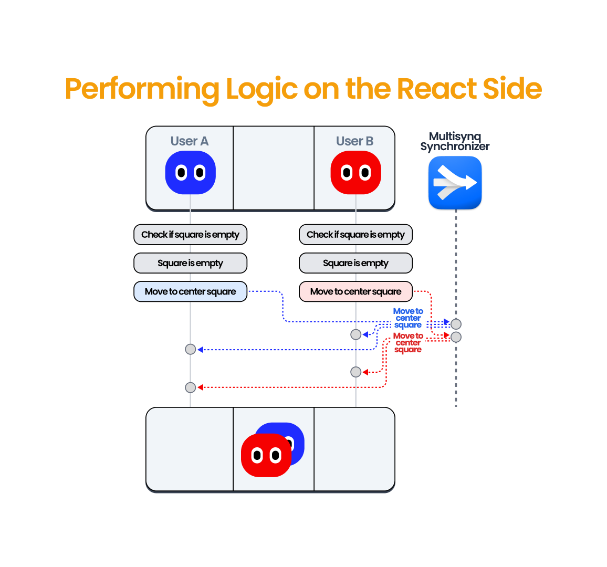
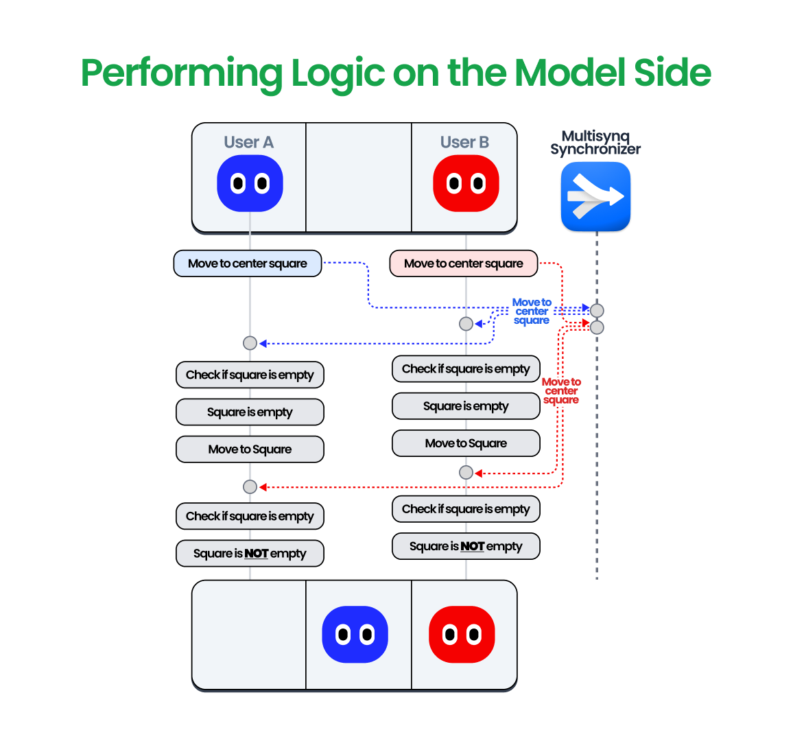

# Croquet

[Croquet](https://multisynq.io/docs/croquet/) is a framework that allows creating synchronized multi-user applications without writing any backend or network code.
It makes use of synchronizer servers to bounce events from one user to all users, ensuring event order and timing.

React Together leverages Croquet to synchronize React applications.
More specifically, it uses a thin wrapper for React, called `@croquet/react`, to maintain a synchronized state store, that is accessible via the React Together hooks.

However, certain applications require stronger consistency guarantees that currently cannot be implemented solely with React Together.
Consider a game where multiple players move on a 2D board, and no two players can occupy the same square simultaneously.

A naive approach might involve checking if the destination square is empty before moving there.
However, this can lead to race conditions.
For instance, if two players attempt to move to the same square and both check its availability before the other player moves, both will end up on the square, breaking the application's logic.



Croquet elegantly solves this problem by design: Instead of broadcasting the result of each action, users broadcast the intended action.
All actions from all users are then executed by everyone in the same order.
This mechanism ensures that only one player can ultimately move to a specific square.



For applications with such consistency requirements, we strongly recommend exploring @croquet/react and implementing such logic on the model side.
Rest assured, you can do this while continuing to use React Together.


### React Together + @croquet/react

`@croquet/react` allows you to define custom logic by implementing a model class.
We recommend checking their [documentation](https://multisynq.io/docs/croquet-react/) and [tutorials](https://multisynq.io/docs/croquet-react/tutorial-1_React_Simple_Counter.html) for detailed guidance.

**Important:**
Ensure your model extends `ReactTogetherModel` to maintain React Together functionality

```typescript
import { ReactTogetherModel } from '@multisynq/react-together'

export class OverrideModel extends ReactTogetherModel {
  init() {
    super.init({})

    this.subscribe(this.id, 'my-event', this.handleMyEvent)
    // Additional model initialization and subscriptions
  }

  handleMyEvent() {
    // Event handling logic
  }
}

// Register your model
OverrideModel.register('OverrideModel')
```

Configure React Together to use your custom model by passing the class in the `sessionParams` prop of the `ReactTogether` component:

```typescript
import { ReactTogether } from '@multisynq/react-together'
import { OverrideModel } from './models'

export default function App() {
  return (
    <ReactTogether
      sessionParams={{
        // Your session params
        model: OverrideModel
      }}
    >
      {/* Your App content */}
    </ReactTogether>
  )
}
```

Now that we have React Together running our model, we can use the `usePublish` hook to publish events to be executed on the model side:

```typescript
import { CroquetReact } from '@multisynq/react-together'

const { usePublish, useModelSelector } = CroquetReact

function MyComponent() {
  const model = useModel()
  const publishEvent = usePublish((d) => [model.id, 'my-event', d])
  // Component logic
}
```

**Note:** We recommend you to import the `@croquet/react` API via the `CroquetReact` object.
